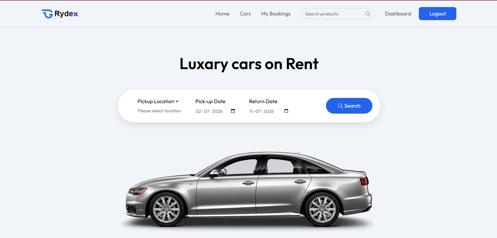
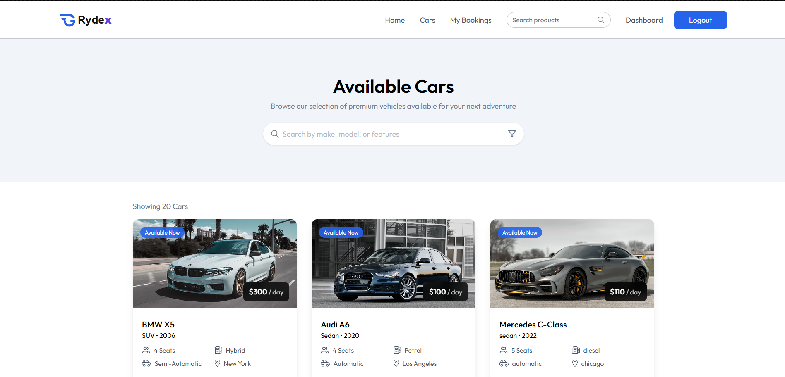
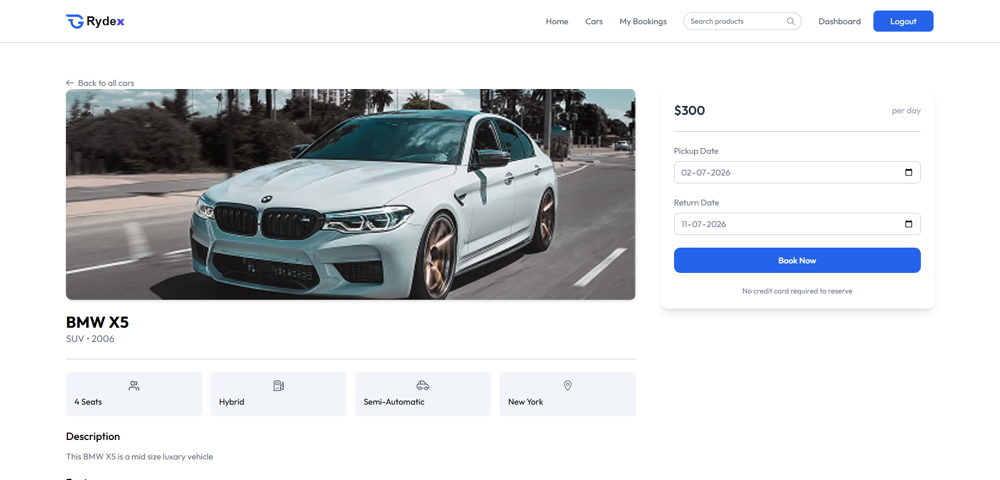
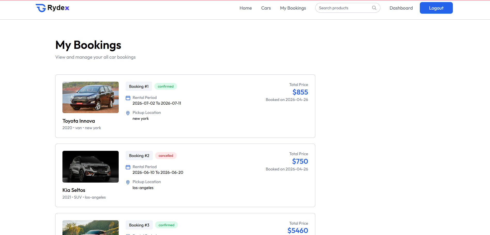
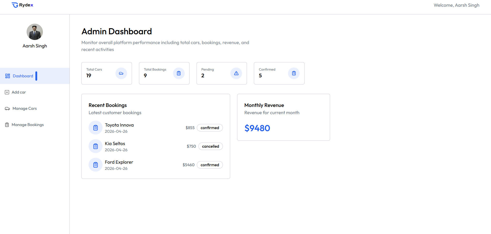
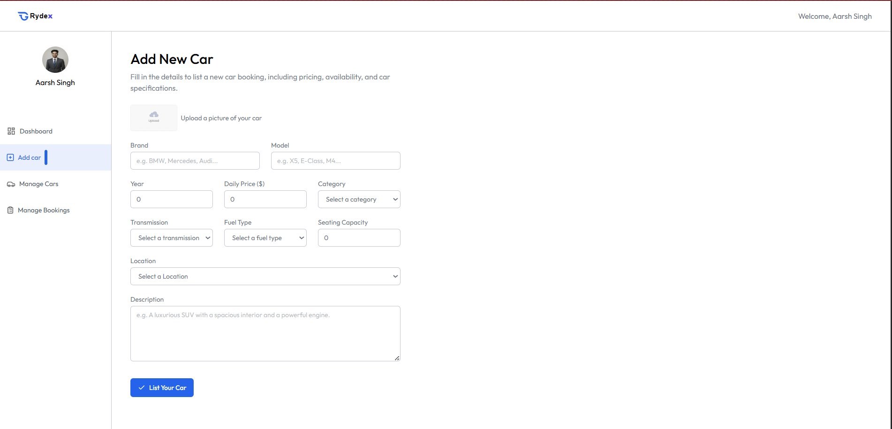
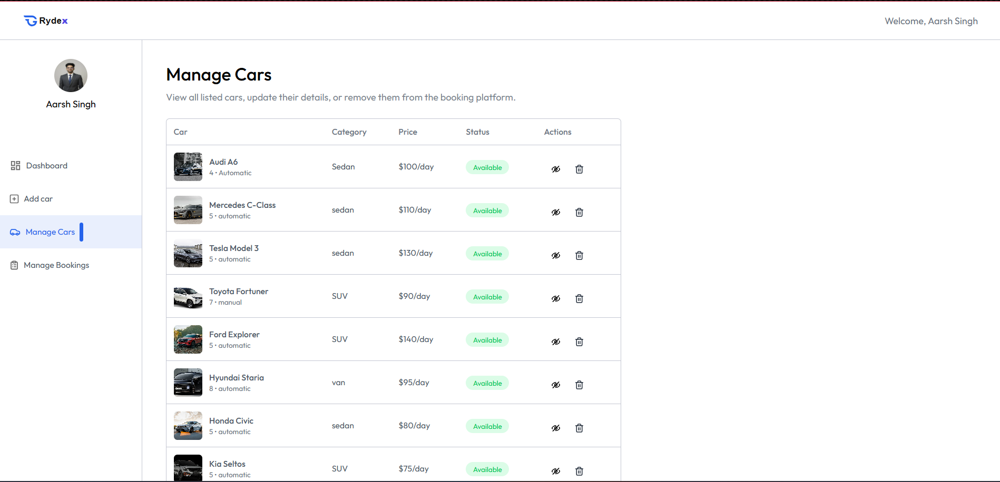
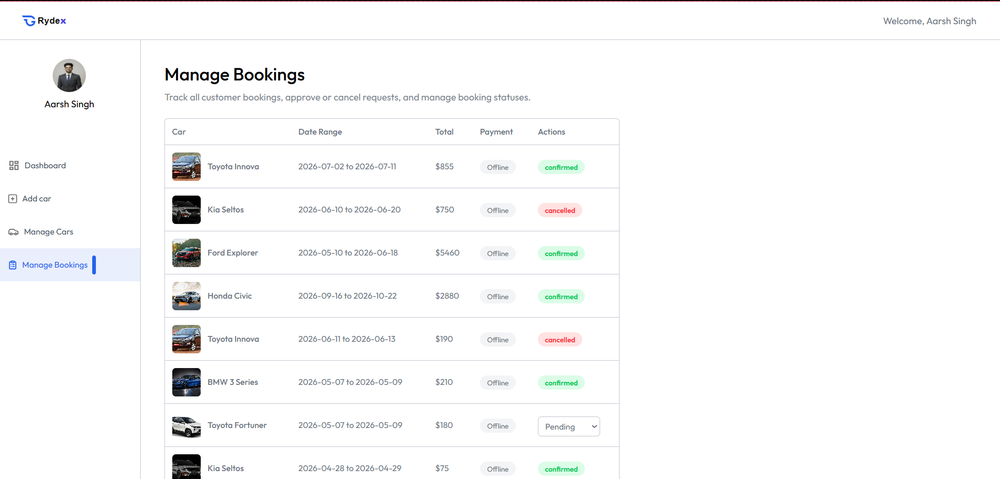

# 🚀 Rydex — Car Rental Booking Platform


- Built a full-stack car rental platform using **React, Node.js, Express, and MongoDB**, supporting end-to-end booking workflows  
- Implemented **backend validation to prevent double booking**, ensuring data consistency across concurrent requests  
- Designed **role-based architecture (User & Owner)** with JWT authentication and protected API routes  
- Developed **car inventory management system** with image uploads using Multer and optimized delivery via ImageKit  
- Engineered **date-based booking system** with dynamic price calculation and booking lifecycle management  
- Improved user experience with **responsive UI and real-time availability filtering**

---

## 🌐 Live Demo

👉 https://aarsh-rydex.vercel.app/

### Demo Credentials

- Email: vivek@gmail.com  
- Password: Vivek@123

---

## ✨ Why This Project Stands Out

- Implements **real booking validation** (prevents double booking conflicts)
- Demonstrates **role-based product architecture** (User vs Owner systems)
- Handles **end-to-end workflow**: browse → check availability → book → manage
- Integrates **image upload & optimization (ImageKit)**
- Built with **modern stack (React, Express, MongoDB)**

---

## 🧠 Core Features

### 🔐 Authentication & Access Control
- JWT-based authentication
- Role-based authorization (User / Owner)
- Protected API routes & session persistence

---

### 🚗 Car Inventory Management (Owner)
- Add cars with image upload (Multer + ImageKit)
- Toggle availability status
- Delete/manage listed vehicles
- Owner-specific inventory dashboard

---

### 🔍 Car Discovery (User)
- Browse all available cars
- Search by **location + date**
- Filter by category, fuel type, transmission
- Responsive card-based UI

---

### 📅 Booking System (Core Logic)
- Date-based car booking
- Backend validation to prevent overlapping bookings
- Automatic price calculation based on rental duration
- Booking lifecycle: **pending → confirmed → cancelled**

---

### 📊 Owner Dashboard
- Total cars & bookings overview
- Pending vs completed bookings
- Recent activity tracking
- Monthly revenue calculation

---

### ⚙️ Data Integrity & Backend Logic
- Availability validation before booking creation
- Prevents conflicting date bookings
- Backend-first validation approach

---

## 📸 Screenshots

### 🏠 Home Page
<p align="center">
  
</p>

> Landing page with search functionality and featured cars.

---

### 🚗 Car Listings
<p align="center">
  
</p>

> Browse available cars with filters, pricing, and specifications.

---

### 📅 Booking Flow
<p align="center">
  
</p>

> Select pickup and return dates with real-time availability validation.

---

### 📖 My Bookings (User)
<p align="center">
  
</p>

> Users can view booking history, status, and rental details.

---

### 📊 Owner Dashboard
<p align="center">
  
</p>

> Overview of cars, bookings, and revenue insights.

---

### 🚗 Add Car (Owner)
<p align="center">
  
</p>

> Owners can add cars with images and specifications.

---

### 🛠️ Manage Cars (Owner)
<p align="center">
  
</p>

> Manage inventory, toggle availability, and delete listings.

---

### 📋 Manage Bookings (Owner)
<p align="center">
  
</p>

> Owners can view and update booking status (pending / confirmed).
---

## 🛠️ Tech Stack

### Frontend
- React 19 + Vite
- Tailwind CSS 4
- React Router 7
- Axios
- React Hot Toast

---

### Backend
- Node.js + Express 5
- MongoDB + Mongoose
- JWT (jsonwebtoken)
- bcrypt
- Multer (file uploads)
- ImageKit (image storage & optimization)

---

## 🏗️ System Architecture

Rydex follows a layered architecture separating frontend, backend, and business logic.

### 🔄 Flow

Client (React)  
↓  
Routes (Express)  
↓  
Controllers (Business Logic)  
↓  
Database (MongoDB)  

---

## 🧠 Challenges & Learnings

### Preventing Double Booking
Ensuring a car cannot be booked for overlapping dates required backend-level validation.  
Implemented date range checks using MongoDB queries before booking creation.

### Handling Image Uploads
Faced issues with file handling and storage.  
Solved using Multer for uploads and ImageKit for optimized delivery.

### Authentication & State Sync
Managing JWT authentication across frontend and backend required careful handling of headers and local storage.

### Data Consistency
Moved validation logic from frontend to backend to avoid inconsistent booking states.

---

## 📁 Folder Structure

```text
Rydex/
├── client/
│   ├── src/
│   │   ├── components/
│   │   ├── pages/
│   │   ├── context/
│   │   └── assets/
│
├── server/
│   ├── controllers/
│   ├── models/
│   ├── routes/
│   ├── middleware/
│   └── configs/
│
└── README.md
